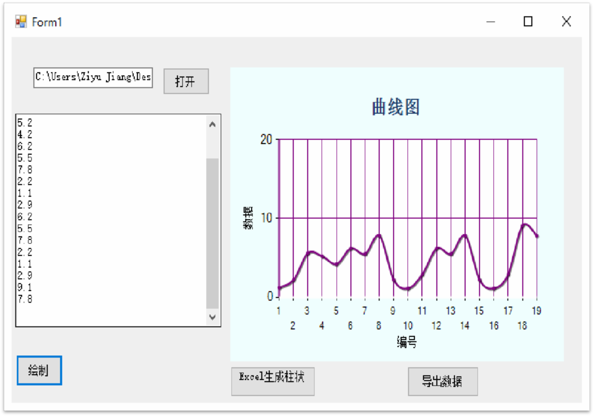

# 数据录入与绘制

## 数据录入与绘制有哪些功能？
 
* 在Winform界面中，用户点击打开按钮，能打开一个文本文件
* 能将已打开的文本文件中的数据显示在界面的Textbox中
* 用户点击Excel生成柱状图按钮，能将文中数据在一个新的Excel中生成一张该文本文件的数据表和相应的柱状图
* 用户点击导出数据按钮，能将该文本文件以word的格式保存
 
 

## 问题反馈
个人项目 若有不足 欢迎指正
 

## 项目展示
* 
* 
 

## 关于作者
* warren@伟
* E-mail:warren_wzw@163.com